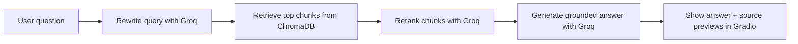
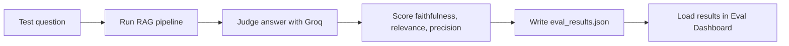

# SEC Filing RAG

A production-style Retrieval-Augmented Generation (RAG) app for asking grounded questions about SEC 10-K filings from NVIDIA, Apple, Microsoft, Tesla, and Amazon.

The project includes:

- a Gradio chat-style interface for asking filing questions
- a ChromaDB vector store built from downloaded 10-K text
- Groq-powered query rewriting, reranking, and answer generation
- an LLM-as-judge evaluation pipeline with a saved dashboard view
- Hugging Face Spaces compatibility out of the box 

## What This App Does

This repository turns SEC annual reports into a searchable research assistant.

Users can:

- ask company-specific or cross-company questions
- inspect source snippets used to answer each question
- use quick-question chips to test the system instantly
- load precomputed evaluation results from disk without triggering new API calls

## Demo Flow

At a high level, the system works like this:



The evaluation pipeline adds a second layer:



## Current Interface

The app currently has two user-facing areas:

### 1. Ask

- centered chat-like composer
- company dropdown in the composer controls
- hard-coded quick-question chips
- grounded answer panel
- source preview panel
- loading states while retrieval is running

### 2. Eval Dashboard

- separate tab from the chat experience
- reads `eval_results.json` from disk
- does **not** run live evaluation when a user clicks the button
- designed this way to protect Groq free-tier limits

## Supported Companies

The current dataset is built from the latest available 10-K for:

- NVIDIA
- Apple
- Microsoft
- Tesla
- Amazon

These companies are defined in [`rag/fetcher.py`](rag/fetcher.py).

## Repository Structure

```text
sec_filling_rag/
├── app.py
├── README.md
├── requirements.txt
├── eval_results.json
├── data/
│   └── raw/
│       ├── amazon_10k.txt
│       ├── apple_10k.txt
│       ├── microsoft_10k.txt
│       ├── nvidia_10k.txt
│       └── tesla_10k.txt
├── chroma_db/
└── rag/
    ├── fetcher.py
    ├── ingestor.py
    ├── retriever.py
    └── evaluator.py
```

## Architecture

### `rag/fetcher.py`

Responsible for downloading the latest 10-K filings from the SEC EDGAR system.

- looks up the latest 10-K accession number per company
- finds the main filing document from the filing index page
- strips scripts, styles, and hidden XBRL content
- saves clean plain-text files to `data/raw/`

### `rag/ingestor.py`

Responsible for preparing the vector database.

- loads downloaded filing text files
- chunks each document with `RecursiveCharacterTextSplitter`
- attaches metadata such as company and chunk index
- embeds chunks with Sentence Transformers
- persists everything into ChromaDB

### `rag/retriever.py`

Responsible for the live RAG answer pipeline.

- rewrites the user question for better retrieval
- retrieves the top chunks from ChromaDB
- reranks them with an LLM
- builds a grounded answer prompt
- returns the answer plus source previews

### `rag/evaluator.py`

Responsible for offline evaluation.

- runs a fixed set of test questions
- calls the same RAG pipeline used by the app
- judges the answer against retrieved chunks
- scores faithfulness, answer relevance, and context precision
- writes results to `eval_results.json`

### `app.py`

Responsible for the Gradio UI and app startup.

- auto-builds the vector store on startup if `chroma_db/` is missing
- loads the vector store once and reuses it
- renders the Ask tab and Eval Dashboard
- loads saved evaluation results from disk

## Tech Stack

- **UI:** Gradio 5.23
- **LLM API:** Groq
- **Vector DB:** ChromaDB
- **Embeddings:** Sentence Transformers
- **Parsing:** BeautifulSoup + lxml
- **Chunking:** LangChain text splitters
- **Data source:** SEC EDGAR

## Models Used

Current defaults in the codebase:

- **Embedding model:** `all-MiniLM-L6-v2`
- **Optional larger embedding model:** `BAAI/bge-large-en-v1.5`
- **Query rewrite model:** `llama-3.1-8b-instant`
- **Answer model:** `llama-3.1-8b-instant`
- **Reranker model:** `meta-llama/llama-4-scout-17b-16e-instruct`
- **Judge model:** `llama-3.1-8b-instant` by default, overrideable by env var

## Environment Variables

Create a `.env` file in the project root.

Example:

```env
GROQ_API_KEY=your_groq_api_key_here
NAME=Your Name
GMAIL=your_email@gmail.com
USE_LARGE_MODEL=False
GROQ_MAX_RETRIES=5
GROQ_BASE_RETRY_DELAY=15
GROQ_JUDGE_MODEL=llama-3.1-8b-instant
```

### Required

- `GROQ_API_KEY`
  - required for rewrite, rerank, answer generation, and evaluation

- `NAME`
- `GMAIL`
  - used to build the SEC `User-Agent` header
  - SEC requests should always identify the caller properly

### Optional

- `USE_LARGE_MODEL`
  - set to `True` to use `BAAI/bge-large-en-v1.5`
  - default is `False`

- `GROQ_MAX_RETRIES`
  - retry count for rate-limited or transient Groq failures

- `GROQ_BASE_RETRY_DELAY`
  - base wait time in seconds for exponential backoff

- `GROQ_JUDGE_MODEL`
  - override the evaluation judge model

## Installation

### 1. Clone the repository

```bash
git clone <your-repo-url>
cd sec_filling_rag
```

### 2. Create and activate a virtual environment

**Windows (PowerShell)**

```powershell
python -m venv .venv
.venv\Scripts\Activate.ps1
```

**macOS / Linux**

```bash
python -m venv .venv
source .venv/bin/activate
```

### 3. Install dependencies

```bash
pip install -r requirements.txt
```

## Local Development

### Option A: Let the app auto-ingest on first run

If `chroma_db/` does not exist, `app.py` will:

1. fetch the filings
2. build embeddings
3. create ChromaDB
4. launch the app

Run:

```bash
python app.py
```

### Option B: Build the data pipeline manually

This is useful when you want more control over the setup process.

#### Step 1: Fetch SEC filings

```bash
python .\rag\fetcher.py
```

#### Step 2: Build the vector store

```bash
python .\rag\ingestor.py
```

#### Step 3: Launch the app

```bash
python app.py
```

## Running the Evaluation Pipeline

The evaluation pipeline is intentionally separate from the UI.

Run it manually:

```bash
python .\rag\evaluator.py
```

This will:

- answer 7 fixed benchmark questions
- score each answer on 3 metrics
- write the results to `eval_results.json`

The Gradio Eval Dashboard then reads that saved file from disk.

This design is intentional:

- it prevents accidental live re-evaluation from the UI
- it avoids unnecessary Groq usage
- it is safer for free-tier API limits

## Sample Questions

Try questions like:

- `What export control risks does NVIDIA face?`
- `What were Apple's main revenue sources?`
- `What are Microsoft's key AI investments?`
- `What risks does Tesla mention regarding autonomous driving?`
- `How does Amazon describe its AWS business?`
- `What do these companies say about competition?`

## Output Artifacts

### `data/raw/*.txt`

Clean plain-text versions of downloaded SEC filings.

### `chroma_db/`

Persistent Chroma vector store used by the app.

### `eval_results.json`

Saved evaluation report containing:

- question-by-question results
- answer text
- source previews
- per-metric scores
- overall averages

The current checked-in summary is:

- Faithfulness: `4.0 / 5`
- Answer Relevance: `4.86 / 5`
- Context Precision: `4.0 / 5`
- Overall: `4.29 / 5`

## Hugging Face Spaces Deployment

This repository is already structured for Hugging Face Spaces:

- the Spaces YAML front matter is kept at the top of this README
- `sdk: gradio` is configured
- `app_file: app.py` points to the app entrypoint
- `requirements.txt` contains the Python dependencies

### Recommended HF Space setup

Add these as **Secrets** in your Space:

- `GROQ_API_KEY`
- `NAME`
- `GMAIL`

Optional secrets or variables:

- `USE_LARGE_MODEL`
- `GROQ_MAX_RETRIES`
- `GROQ_BASE_RETRY_DELAY`
- `GROQ_JUDGE_MODEL`

### Deployment behavior on Spaces

On startup, the app checks whether `chroma_db/` exists.

- If it exists, the app loads it and starts quickly.
- If it does not exist, the app will fetch filings and build the vector store at startup.

For faster cold starts on Hugging Face, it is usually better to prebuild `chroma_db/` and include it with the Space if repository size permits.

## Operational Notes

### SEC request etiquette

The fetcher sends a custom `User-Agent` using `NAME` and `GMAIL`.

That is important for respectful and policy-compliant access to the SEC data endpoints.

### Groq free-tier limits

The evaluator can consume tokens quickly because each benchmark question may involve:

- query rewrite
- reranking
- answer generation
- answer judging

To reduce failures, the code now includes retry and backoff handling for Groq requests.

### First-run model downloads

The first embedding load may take longer because the Sentence Transformers model needs to download locally before use.

### CPU-first setup

The current ingestion code uses CPU embeddings by default:

```python
model_kwargs={"device": "cpu"}
```

This keeps local setup simpler and works in Spaces, but larger embeddings will still be slower than the default MiniLM option.

## Why the Eval Dashboard Loads From Disk

The Eval Dashboard in the UI does **not** trigger a fresh run of `evaluator.py`.

Instead, it loads the saved JSON file from disk. This is a deliberate design choice because:

- live evaluation is expensive
- repeated judge calls can hit Groq free-tier limits
- precomputed metrics make the dashboard fast and predictable

## Future Improvements

Natural next steps for the project:

- add more companies and filing types
- support yearly filing comparison
- expose retrieval settings in the UI
- add citations with direct source chunk expansion
- introduce batch evaluation and regression tracking


## Quick Start

If you just want to run the app:

```bash
pip install -r requirements.txt
python app.py
```

Then open the Gradio app in your browser and start asking questions about SEC filings.
